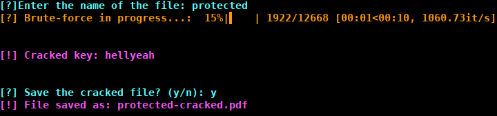

# brute_pdf
## Installation
 We need to install the following dependencies:
  - [pikepdf](https://pikepdf.readthedocs.io/en/latest/)
  - [tqdm](https://tqdm.github.io/)
```shell
$ python -m virtualenv venv
$ source venv/bin/activate
(venv)$ pip3 install -r requirements.txt
```
## Usage
 We use a custom dictionary, [keylist.txt](keylist.txt) to brute force pdf passwords.

 We can use the following command to run the brute force attack:
```shell
$ python brute.py
```
The program first ask for the pdf file name, and then proceeds to brute force the password. If the password is found, the program will print the password and ask if you want to save the cracked file with the password, if not, the program will simply exit.


## License
 🄯 copyleft all wrongs reserved